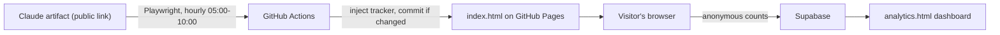

# SS Study Smarter – Handover & Setup Guide

This guide lets you (the owner of the original Claude artifact) run your own copy of the site:
a GitHub Pages mirror of the artifact that **auto-updates daily** and has a **private visitor analytics dashboard**.

Reference copy: https://github.com/mohamedelsaadany-art/SS-Study-Smarter
Reference site: https://mohamedelsaadany-art.github.io/SS-Study-Smarter/

---

## 1. What the project is

| Piece | File | Purpose |
|---|---|---|
| The site | `index.html` | Full HTML snapshot of the Claude artifact "IM Camp Exams" (a single self-contained page). Overwritten by the sync. |
| Daily sync | `.github/workflows/sync.yml` + `scripts/fetch_artifact.py` | Opens the public artifact link in a real browser (Playwright), grabs the artifact's HTML, injects the tracker, commits if changed. |
| Tracker | `tracker.js` | Anonymous usage counters. Hooks the app's own `localStorage` saves, so the artifact itself needs no edits. |
| Config | `config.js` | Supabase URL + public (publishable) key. Empty = tracking off. |
| Dashboard | `analytics.html` | Visitor analytics page (unlisted, no login). |
| Database | `supabase/schema.sql` | Tables, security rules and the stats function. |

### How it works



Student progress (answers, timers) is stored **only in each visitor's own browser** (`localStorage`, keys `imcamp-exam-day<N>-v2`). The tracker never sends answer text. It sends only: a random visitor ID, the exam day, and counts (page view, questions answered, part finished, exam finished).

---

## 2. Setup steps

### 2.1 Create the GitHub repo
1. Create a **public** repo (e.g. `SS-Study-Smarter`) and copy all files from the reference repo into it (fork or download).
2. **Settings → Pages**: Source = `Deploy from a branch`, Branch = `main`, Folder = `/ (root)`.
3. **Settings → Actions → General → Workflow permissions**: set **Read and write permissions** (the workflow pushes commits).

### 2.2 Point it at YOUR artifact
Edit `scripts/fetch_artifact.py`:
```python
URL = "https://claude.ai/artifact/<YOUR-ARTIFACT-ID>"
MARKER = "IM Camp"   # any text that always appears in your page; used as a sanity check
```
Optional: change the schedule in `.github/workflows/sync.yml` (cron is in **UTC**).

> **Simpler alternative for the owner:** since you own the artifact, you can export/download its HTML (or copy it) and commit it as `index.html` yourself. The Playwright fetch exists only because the artifact link can't be downloaded with a plain request (Cloudflare blocks it). If you go manual, still add this line before `</body>` so analytics works:
> `<script src="config.js"></script><script src="tracker.js"></script>`

### 2.3 Set up analytics (Supabase, free)
1. Create a free project at https://supabase.com (generate a strong DB password; keep it private).
2. **SQL Editor → New query** → paste all of `supabase/schema.sql` → **Run**. "Success. No rows returned" is correct.
3. **Project Settings → API Keys** → copy:
   - **Project URL** (`https://xxxx.supabase.co`, no `/rest/v1/`)
   - **Publishable key** (`sb_publishable_...`) or legacy **anon** key
   - NEVER use the `secret` / `service_role` key.
4. Put them in `config.js`:
   ```js
   window.SSA = { url: "https://xxxx.supabase.co", key: "sb_publishable_..." };
   ```
5. Commit and push.

### 2.4 First run
1. **Actions → Daily artifact sync → Run workflow**.
2. Open the log of the "Fetch artifact" step. You want `TITLE: <your title>` and `OK <size>`.
3. Visit the site; answer one question; open `…/analytics.html`. You should see 1 visitor and 1 answered question.

---

## 3. Daily behaviour

- The workflow runs **hourly 05:00–10:00 Cairo time** (`cron: "0 2-7 * * *"`, UTC+3).
- At the start of each run it checks for an `Auto-update <today>` commit. If one exists, the run **skips** everything. If the artifact hasn't changed, nothing is committed and the next hour tries again.
- **Manual runs** (Run workflow button) ignore the skip rule.
- When Egypt ends daylight saving time (late October), the window shifts to 04:00–09:00 unless you change the cron to `0 3-8 * * *`.

---

## 4. Analytics details

- Dashboard: `https://<user>.github.io/<repo>/analytics.html`. **No password**; protection is only that the link isn't shared (and `noindex`). The Supabase public key is public by design, so someone technical could call the stats function. It exposes anonymous aggregate counts only. To lock it down later, re-add a passphrase check in `get_stats()` (earlier version used a `settings` table).
- Metrics: unique visitors, page views, questions answered, parts done, exams done, per day and per exam day (Cairo timezone).
- "Question answered" = a question with at least one non-empty answer box (grouped by stripping a trailing `_<digit>` from answer keys). Verify against real data and adjust `answeredCount()` in `tracker.js` if numbers look off.
- Counting starts at install; earlier progress isn't backfilled.
- Visitors can write counts but cannot read the table (Row Level Security: insert-only policy, no select policy).
- Remove test rows with `delete from events where vid = 'selftest';` in the SQL Editor.
- Consider telling visitors the site collects anonymous usage stats.

---

## 5. Known caveats

| Issue | Detail |
|---|---|
| Cloudflare | `claude.ai` challenges bots. A real (headed) browser under `xvfb-run` got through from GitHub's servers in testing, but it may be blocked in the future. Fix: hourly retries (built in), or export the HTML manually. |
| Pages build cancellations | The page is ~10 MB; a Pages build takes 1–5 min and a new push **cancels** a build in progress. Avoid pushing several times in a row. |
| Artifact features | Anything depending on Claude's runtime (its own storage, calls to Claude) may not work off-Claude. Test the mirror. |
| Cron delays | GitHub scheduled runs can start 5–30 minutes late. |
| 60-day rule | GitHub disables schedules after 60 days without repo activity. Daily commits normally prevent this. |
| Free tiers | Public repos have free Actions minutes. Supabase free projects **pause after ~7 days of no API activity**; visits keep it alive, or resume it from the dashboard. |

---

## 6. Optional: local backup task (Windows)

The reference setup also has a Windows Scheduled Task that runs `sync.py` (a copy of the same logic using local Brave) at 09:00. It is not needed once GitHub Actions works, and it can race with the workflow, so skip it unless you want a fallback.

---

## 7. Security checklist

- [ ] Only the publishable/anon key is in `config.js`.
- [ ] `secret` / `service_role` key and DB password are not in the repo.
- [ ] Row Level Security is enabled on `events` (done by `schema.sql`).
- [ ] The analytics link is shared only with people who should see it.
