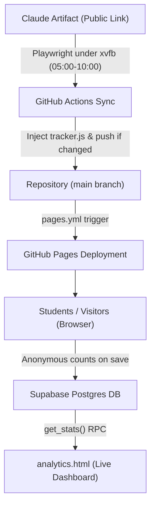

# SS Study Smarter – Complete Handover & Architecture Guide

This guide is prepared for the owner of the original Claude artifact to set up, operate, and maintain their own complete version of the **SS Study Smarter** platform:
A GitHub Pages deployment of the test-prep app that **auto-updates daily from Claude** and features a **modern, private visitor analytics dashboard with revisitor retention and trend telemetry**.

* **Reference Repository**: https://github.com/mohamedelsaadany-art/SS-Study-Smarter
* **Reference Live Site**: https://mohamedelsaadany-art.github.io/SS-Study-Smarter/
* **Reference Live Analytics**: https://mohamedelsaadany-art.github.io/SS-Study-Smarter/analytics.html

---

## 1. Architecture Overview

| Component | File / Location | Description |
|---|---|---|
| **Exams Web App** | `index.html` | Self-contained, full HTML interactive snapshot of "IM Camp Exams". Automatically kept in sync with your latest Claude artifact revisions. |
| **Pages Deployment** | `.github/workflows/pages.yml` | GitHub Actions workflow that bundles and deploys the site to GitHub Pages in ~30 seconds on every push. |
| **Automated Daily Sync** | `.github/workflows/sync.yml`<br>`scripts/fetch_artifact.py` | Headed Playwright automation running under `xvfb-run`. Runs hourly 05:00–10:00 Cairo time, pulls the newest artifact HTML, injects telemetry, and pushes commits if content changed. |
| **Telemetry Tracker** | `tracker.js` | Privacy-respecting client telemetry agent. Hooks into the app's native `localStorage` saves; counts solved questions and exam completions without ever transmitting student answer text. |
| **Telemetry Config** | `config.js` | Contains your public Supabase URL and publishable (anon) API key. Safe to publish publicly. |
| **Analytics Dashboard** | `analytics.html` | Modern telemetry dashboard with **Light/Dark theme toggle**, **Revisitor retention cohorts**, and **Day-over-day trajectory charts**. |
| **Database Schema** | `supabase/schema.sql` | PostgreSQL schema, Row-Level Security policies, and secure `get_stats()` analytical aggregation function. |

### System Workflow



> **Student Privacy Guarantee**: All question drafts, answers, and timers remain strictly inside the student's browser (`localStorage`). The tracker records only a random anonymous device ID (`vid`), the exam day index, and numerical counters (page view, question count, exam complete).

---

## 2. Step-by-Step Setup Guide

### 2.1 Repository Setup
1. Create a **public** GitHub repository (e.g. `SS-Study-Smarter`).
2. Clone or copy all repository files from the reference repository into your new repo.
3. Configure GitHub Pages:
   * Go to **Settings → Pages**.
   * Under **Build and deployment → Source**, choose **GitHub Actions** (this enables `.github/workflows/pages.yml` for fast deploys).
4. Configure Workflow Permissions:
   * Go to **Settings → Actions → General**.
   * Under **Workflow permissions**, select **Read and write permissions** (needed for the sync job to commit updates).

### 2.2 Link Your Claude Artifact
Open `scripts/fetch_artifact.py` and configure your artifact URL:
```python
URL = "https://claude.ai/artifact/<YOUR-ARTIFACT-ID>"
MARKER = "IM Camp"   # Text phrase present in your artifact to ensure valid fetch
```

> **Manual Alternative (Zero Scraper Dependency)**:
> Since you own the artifact, you can also export the artifact's HTML directly from Claude and commit it as `index.html`. If you do this manually, simply ensure the tracker snippet is included right before `</body>`:
> ```html
> <script src="config.js"></script><script src="tracker.js"></script>
> ```

### 2.3 Set Up Free Analytics Database (Supabase)
1. Sign up for a free account at [supabase.com](https://supabase.com) and click **New Project**:
   * **Project Name**: `ss-study-smarter`
   * **Database Password**: Generate and securely store a strong password.
   * **Region**: Select your preferred region (e.g., Frankfurt / Central EU).
2. Open **SQL Editor → New Query**:
   * Copy and paste the entire contents of [`supabase/schema.sql`](file:///C:/Users/Mohamed/.gemini/antigravity/scratch/SS-Study-Smarter/supabase/schema.sql).
   * Click **Run**. Output should say `Success. No rows returned`.
3. Retrieve your API credentials:
   * Navigate to **Project Settings → API Keys** (or **Data API**).
   * Copy the **Project URL** (e.g. `https://xxxx.supabase.co`).
   * Copy the **Publishable key** (`sb_publishable_...`) or legacy **anon public key**.
   * *Never use the secret or service_role key.*
4. Paste your credentials into `config.js`:
   ```javascript
   window.SSA = {
     url: "https://your-project.supabase.co",
     key: "sb_publishable_your_key_here"
   };
   ```
5. Commit and push your changes to GitHub `main`.

---

## 3. Daily Automation Behavior

* **Execution Window**: Runs **hourly between 05:00 and 10:00 Cairo time** (`cron: "0 2-7 * * *"` in UTC).
* **Early-Exit Optimization**: Each hourly run inspects the git history for an `Auto-update <today>` commit. If an update was already committed earlier in the morning, the workflow exits in under 5 seconds to conserve CI resources.
* **Manual Trigger**: You can run the sync at any time by clicking **Actions → Daily artifact sync → Run workflow**.
* **Daylight Saving Time Note**: Egypt ends Daylight Saving Time in late October. When the clock changes, adjust the schedule in `.github/workflows/sync.yml` to `0 3-8 * * *` if you want to keep the local 05:00–10:00 window.

---

## 4. Modern Analytics Dashboard Features

Your dashboard is located at `https://<username>.github.io/<repo>/analytics.html`.

### Key Features:
1. **Light / Dark Mode**:
   * Full theme toggle in the header actions bar.
   * Remembers user selection in `localStorage` (`ssa-theme`).
   * Automatically synchronizes with system preference (`prefers-color-scheme`).
2. **Revisitor & Student Retention Telemetry**:
   * **Revisitors KPI Card**: Tracks students returning for multi-day study sessions.
   * **Retention Ratio Visualizer**: Interactive visual distribution bar for First-Time vs. Returning students.
   * **Historical Cohort Columns**: Table breaks down daily traffic into New Students vs. Revisitors.
3. **Trend Over Days Trajectory**:
   * **Momentum Bar**: Displays 7-day trajectory direction (`↑ +N vs yesterday`, `→ Steady`), peak practice day, and daily question velocity.
   * **Interactive SVG Bar Chart**: Toggle views between **All Visitors**, **New vs. Revisitors** (stacked multi-color visualization), and **Questions Solved**.
4. **Exam Day Engagement Breakdown**:
   * Progress bars showing engagement and question volume across each specific day of the camp.
5. **Real-time Live Sync**:
   * Auto-refreshes telemetry in the background every 60 seconds.
   * Live status indicator (`● Live Database Connected`).

---

## 5. Security & Access Model

* **Dashboard Access**: The dashboard link (`analytics.html`) is unlisted and tagged with `<meta name="robots" content="noindex,nofollow">`. It is accessed directly by anyone with the link.
* **Database Security (RLS)**:
  * Visitors have **insert-only permissions** restricted to valid event types (`view`, `answered`, `part_done`, `exam_done`).
  * Table `select` queries from anonymous clients are blocked.
  * Only the `get_stats()` server function (marked `security definer`) aggregates anonymous counts for dashboard presentation.
* **Cleaning Test Data**: If you run tests that you want to purge from stats, execute in Supabase SQL Editor:
  ```sql
  delete from events where vid = 'selftest';
  ```

---

## 6. Operational Notes & Troubleshooting

| Scenario | Cause & Remedy |
|---|---|
| **Cloudflare Verification Challenge** | `claude.ai` protects public artifacts with Cloudflare. The sync runs a full virtual browser via Playwright with automation flags disabled to pass the verification. If Cloudflare blocks an IP, the workflow retries across the hourly window. |
| **Supabase Free Tier Inactivity** | Free Supabase projects pause after ~7 consecutive days without API queries. Student practice traffic keeps it active automatically; if paused, click **Resume** in the Supabase web dashboard. |
| **GitHub Actions Delays** | Scheduled GitHub Actions workflows may occasionally start 5–25 minutes after the hour depending on global queue traffic. |
| **GitHub 60-Day Inactivity Rule** | GitHub pauses scheduled cron workflows on repositories with no git commits for 60 consecutive days. Morning auto-updates normally prevent this. |
